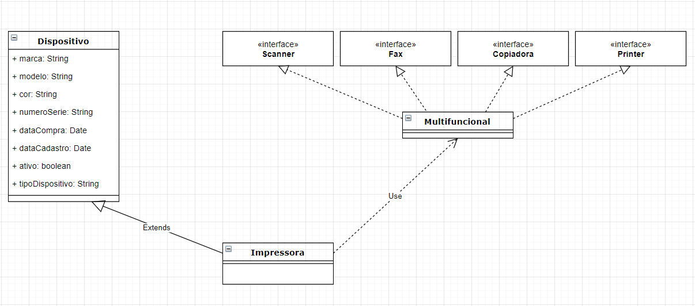

# Bem  vindo ao território de Delphi do Mestre dos Códigos

## Escudeiro

1. Em uma aplicação console, construa um programa que faça o cálculo fatorial do número informado pelo usuário.

2. Em uma aplicação console, construa um programa que leia uma lista de números informada pelo usuário. Em seguida, através do algoritmo merge-sort, faça a ordenação da lista e apresente o resultado.

3. Em uma aplicação console, escreva um programa que leia os seguintes dados: nome do vendedor, salário fixo e total de vendas. Considerando que o salário fixo tem um acréscimo de 15% com base no total vendido, apresente na tela: o nome do usuário, o salário fixo e o valor a receber. Obs: Utilize um objeto para armazenar essas informações do vendedor.

4. Escreva uma aplicação console que receba uma lista de nomes completos (nome e sobrenome) informados pelo usuário. Estes nomes deverão ser convertidos para caixa-mista, ou seja, as iniciais de cada nome devem ser maiúsculas. Leve em consideração que as preposições (“de”, “do”, “dos”, ”e”, etc.) devem ser convertidas para minúsculas.

5. Em uma aplicação console, construa um programa que leia uma lista de frases. Apresente ao usuário apenas as frases que formam um palíndromo.

6. Escreva uma DLL que execute os seguintes cálculos geométricos: área de um triângulo, área do círculo e área do retângulo/quadrado. Construa um programa console que carregue a DLL de forma **dinâmica**. Neste programa, o usuário deve entrar com o tipo de cálculo que deseja executar e os valores referentes ao cálculo. No final da execução, o resultado deve ser apresentado em tela.

7. Escreva uma DLL que transcreva um dado número por extenso. Construa um programa console que faça o carregamento **estático** da DLL. Neste programa, o usuário poderá entrar com um número qualquer e, como saída, o programa deverá transcrever o número por extenso em tela.

8. Em uma aplicação console, escreva uma classe que implemente o algoritmo de pilha. Esta classe deverá utilizar _Generics_ para poder armazenar qualquer tipo de conteúdo e conter os métodos `Push`, `Pop`, `Size` e `IsEmpty`. Após a implementação da classe, faça:
   + Construa dois objetos. Um deve armazenar `strings` e outro deve armazenar inteiros;
   + Adicione três `strings` aleatórias e 15 números aleatórios (podem ser entradas do usuário);
   + Imprima o retorno da função `Size` dos dois objetos;
   + Execute o método `Pop` da pilha de `strings`, mostrando no console a string sendo retirada, até que a pilha esteja vazia;
   + Faça o mesmo procedimento com a pilha de inteiros;
   + Imprima o retorno da função `Size` dos dois objetos;

9. Em uma aplicação console, crie uma classe chamada `TFuncionario` que armazene os dados de funcionários (nome, email e telefone). Crie também uma classe, utilizando _Generics_, chamada `TCacheObjetos`. O seu funcionamento será como um cache de objetos e deverá armazenar instâncias de diferentes tipos. Sendo assim, caso o cache não contenha uma instância da classe solicitada, `TCacheObjetos` deverá criá-la, armazenar no seu cache interno e retornar a instância.
Para testar a aplicação, crie duas variáveis (`funcionario1` e `funcionario2`). Crie também uma instância de `TCacheObjetos` e peça que ele retorne uma instância de `TFuncionario` na variável `funcionario1`. Preencha os valores do funcionário. Em seguida, peça uma instância de `TFuncionario` em `funcionario2`. Os valores das duas variáveis deverão ser iguais, já que serão a mesma instância.

10. Em uma aplicação console, crie uma classe que executará operações matemáticas, chamada  `TClasseMatematica`. Ela terá duas propriedades do tipo `double`, chamadas `Esquerda` e `Direita`, e também uma propriedade que receberá um método anônimo que referencie uma function, com retorno do tipo `double` (crie o tipo com o nome `TOperacaoMatematica`). A aplicação solicitará ao usuário qual operação deve ser executada (+ - * /) e os números da operação (`Esquerda` e `Direita`). De acordo com a entrada do usuário, a operação matemática correta será executada através de um método anônimo, presente na propriedade do tipo `TOperacaoMatematica`.

11. Em uma aplicação console, crie um tipo enumerado que represente os continentes. Construa um `Record Helper` para este tipo com os seguintes métodos:
    + `AsLabel`: com uma descrição amigável ao usuário;
    + `AsString`: com o nome do Enum;
    + `AsByte`: com a representação numérica do Enum;
    + `Parse`: que transforme um Byte no Enum.

12. Criar um Class Helper para a classe `TStringList` com as seguintes funções:
    + `IsEmpty`: Verifica se lista está vazia;
    + `HasDuplicate`: Verifica se a lista contém valores duplicados;
    + `ToJSON`: Verifica se o conteúdo da Lista está no formato Nome=Valor. Caso esteja, transforme o conteúdo conforme a notação JSON e retorne como string (não é necessário utilizar as classes nativas neste momento). Caso não esteja, lance uma exceção informando que não foi possível converter o conteúdo.

13. Crie uma `Interface` com um método de leitura de arquivos (`LerDoArquivo`) e outra `Interface` com um método de escrita de arquivos (`SalvarParaArquivo`). Escreva uma classe que implemente essas duas `Interfaces`, cujos métodos devem carregar e salvar o conteúdo dessa classe. Dica: O conteúdo pode ser uma `TStringList`.

14. Implemente o diagrama abaixo:

15. Crie uma aplicação console. Em uma unit, crie uma classe `TNotepad`, com o método `Executar`. Este método deverá abrir o bloco de notas para o usuário. Em outro arquivo, escreva a classe `TCriadorMagico` que, utilizando `RTTI`, construa uma instância de `TNotepad` de forma dinâmica, apenas pelo seu QualifiedClassName, sem adicioná-la à seção uses. Na unit do projeto, crie uma instância de `TCriadorMagico` para abrir o bloco de notas.

16. Construa uma aplicação VCL. Esta aplicação deverá conter uma classe que, utilizando `RTTI`, faça a listagem das propriedades e métodos de qualquer classe passada por parâmetro. A apresentação da listagem fica por sua conta.

15. A partir de uma sentença digitada pelo usuário, execute a pesquisa na API do GitHub (https://api.github.com/search/repositories?q={busca}), substituindo o texto {busca}  pela entrada do usuário. Carregue a resposta da API em um objeto com os seguintes campos: `id, name, html_url e description`. Por fim, liste todas as ocorrências encontradas para o usuário. A aplicação pode ser console ou VCL.

18. Utilizando classes nativas do Delphi (`System.JSON`), crie um conteúdo JSON que contenha campos do tipo texto, numérico, condicional e lista. O resultado do JSON deve ser igual ao abaixo: 

        {
            "player": "Mystery",
            "active": true,
            "territories": [
                {
                    "territory": "Delphi",
                    "level": "Squire",
                    "experience": 17,
                    "dateLastMission": "2019-08-20"
                },
                {
                    "territory": "SQL",
                    "level": null,
                    "experience": 0,
                    "dateLastMission": null
                },
                {
                    "territory": "Software Architecture",
                    "level": "Knight",
                    "experience": 34,
                    "dateLastMission": "2019-07-01"
                }
            ]
        }

19. Faça o download do <a href="https://github.com/db1global/mestre-dos-codigos/tree/master/docs/files/users-delphi.xml" target="_blank">XML</a>. Crie um projeto VCL no Delphi. Utilizando o assistante XML Data Binding, faça a leitura do XML previamente baixado. Leia o conteúdo do XML nas classes geradas e o apresente em um componente TMemo no seguinte formato:

            ID: 3
            Nome: Tanyahbbhvvg
            Sobrenome: Koch
            Gênero: female
            Data de Nascimento: 22/09/1976
            E-mail: clangosh@example.com
            Telefone: 1-440-621-2581 x967
            Website: http://www.halvorson.com/rerum-soluta-dolores-delectus-inventore-rem-architecto
            Endereço: 812 Terry Wall Alvahchester, ID 41791-2432
            Status: active
            Link (HATEOAS):
            |_ Recurso: https://gorest.co.in/public-api/users/3
            |_ Editar: https://gorest.co.in/public-api/users/3
            |_ Avatar: https://lorempixel.com/250/250/people/?23168 

20. Construa uma aplicação VCL e carregue o XML do exercício anterior. Sem alterar a estrutura base do XML, construa uma tela onde seja possível:
    + Navegar entre os registros;
    + Adicionar, remover e alterar os valores de cada campo;
    + Salvar as modificações em arquivo, mantendo a estrutura original.

## Cavaleiro

1. Em uma aplicação console, defina duas Interfaces, chamadas `IRepositorioNuvem` e `IRepositorioArquivo`. Ambas devem declarar o método "SalvarDados". Em seguida, declare uma classe que implemente as duas Interfaces e codifique o método "SalvarDados" de cada Interface. Use o conceito de _**Method Resolution Clause**_ para tratar o conflito de nomes de métodos iguais.

2. Desenvolva uma aplicação VCL capaz de listar os programas instalados no computador através da leitura do registro do Windows. Para isso, utilize a classe `TRegistry` e apresente, em uma `TDBGrid`, o nome do programa, versão e a empresa.

3. Desenvolva uma aplicação VCL que faça a compactação de arquivos utilizando a classe **`TZipFile`**. Para isso, no formulário principal, permita que o usuário possa selecionar os arquivos que deseja compactar, bem como o caminho e nome do arquivo compactado que será criado. A operação deve observar as seguintes regras e comportamentos:
Arquivos com extensão .EXE não podem ser selecionados (exiba uma mensagem ao usuário);
    + Caso o arquivo que será criado já exista, deve ser sobrescrito sem confirmação;
    + O progresso da compactação deve ser exibido em uma barra de progresso.

4. Em uma aplicação VCL, declare uma _**array**_ **de Tasks** de 3 posições. Cada posição deste _array_ deverá realizar a leitura de um diretório informado pelo usuário e listar todos os arquivos em um componente `TMemo`. Portanto, a aplicação deverá ter 3 componentes `TMemo` e 3 componentes `TEdit` para que o usuário informe os diretórios. Durante a leitura dos diretórios, a aplicação não poderá ficar travada, já que as Tasks deverão ser executadas paralelamente. Para testar a aplicação, informe diretórios com grandes quantidades de arquivos, como a pasta do Windows ou do Microsoft Office.

5. Em uma aplicação console ou VCL, faça um laço de repetição de 1 até 1 milhão listando os números primos encontrados, utilizando o _**TParallel**_ da biblioteca `System.Threading` para paralelizar as iterações.

6. Em uma aplicação VCL, declare uma **classe** _**Thread**_ responsável por fazer o download de um arquivo qualquer da internet. Em seguida, em um formulário, adicione um campo de texto para que o usuário informe o endereço do arquivo, e uma barra de progresso para exibir o progresso do download. A classe `TThread` deverá ser utilizada para baixar o arquivo e atualizar a barra de progresso sem travar a aplicação.

7. Neste exercício, você deverá criar uma aplicação VCL para envio de e-mails utilizando o **Indy**. O formulário deverá disponibilizar campos de texto para informar o endereço SMTP, usuário, senha, porta e configurações de SSL. Além disso, adicione também um campo para informar o anexo e um componente `TMemo` para informar o corpo da mensagem, no qual poderá aceitar comandos HTML. Faça a chamada do envio do e-mail em uma **Anonymous Thread**.

8. Em uma aplicação VCL, você deverá criar um formulário que permita a pesquisa de usuários do GitHub. Para isso, utilize os componentes da paleta **REST Client** para acessar a API pública do GitHub (https://api.github.com/users/{busca}), substituindo o texto "{busca}" pela entrada do usuário. Utilize o componente `TRestResponseDataSetAdapter` para apresentar os resultados em um componente `TDBGrid`.

9. Faça o download e instalação do framework **Horse** (https://github.com/HashLoad/horse) para criar uma API no Delphi. Essa API deverá exportar duas rotas:
    + /estados: retorna uma lista com o nome de todos os estados do Brasil;
    + /estado/{id}: retorna o nome, sigla, região e capital do estado referente ao ID informado. Use a página do Wikipedia para definir os IDs: https://pt.wikipedia.org/wiki/Unidades_federativas_do_Brasil

10. Em uma aplicação VCL, faça a importação do WSDL do site RegExLib (http://regexlib.com/WebServices.asmx?WSDL). Este WebService contém um catálogo de expressões regulares para serem utilizadas. Faça um acesso ao WebService e consulte a expressão regular **nº 3122**, referente a validação de e-mails. Em seguida, utilize essa expressão para validar um endereço de e-mail informado pelo usuário, apresentando o texto "e-mail válido" ou "e-mail inválido" conforme o resultado.

11. Crie uma aplicação VCL que permita a consulta dos dados de endereço através do CEP. Para isso, importe o WSDL dos Correios (https://apps.correios.com.br/SigepMasterJPA/AtendeClienteService/AtendeCliente?wsdl). No formulário, adicione um campo de texto para informar o CEP e apresente os dados do endereço (logradouro, bairro, cidade e UF).

12. Em uma aplicação console, defina uma classe chamada `TOperacoes` que contenha os seguintes métodos:
    + `OrdenarLetras`: receba uma palavra como parâmetro e retorne um texto com as letras ordenadas em ordem alfabética, sem espaços;
    + `ContarOcorrencias`: receba dois parâmetros (uma palavra e uma letra), e conte a quantidade de ocorrências que a letra é encontrada na palavra, retornando um número. Caso a palavra ou a letra estejam vazios, levante uma exceção;
    + `RemoverAcentos`: receba uma palavra como parâmetro e remova todos os acentos (por exemplo: "órgão" para "orgao"). Caso exista algum caracter que não seja alfanumérico, uma exceção deve ser gerada.

Em seguida, implemente **testes unitários** para essa classe, testando inclusive as exceções.

13. Sistemas, para serem testáveis, precisam possuir baixo acoplamento. Assim, durante a etapa de testes, é possível, por exemplo, substituir a camada de persistência de dados por um mock que “fará de conta” que os dados foram salvos com sucesso. Ou ainda, emitir uma exceção simulando um erro na camada de infraestrutura. Para construção de mocks e stubs, existe uma biblioteca gratuita chamada **Delphi-Mocks** (https://github.com/VSoftTechnologies/Delphi-Mocks). Utilizando a biblioteca **Delphi-Mocks**, escreva os teste unitários para a classe `TPessoaService`. Utilize o framework **Delphi-Mocks** para mockar o repositório. Não serão aceitos códigos implementados com classes fake. Os testes devem incluir:
    + O comportamento de quando **TPessoa** está inválido;
    + Garantir que o método de **TPessoaRepository** não será chamado quando **TPessoa** não estiver válida;
    + Garantir que o método de **TPessoaRepository** será chamado quando **TPessoa** estiver válido;
    + O comportamento de `TPessoaService` quando **TPessoaRepository** emite uma exceção `EDatabaseError`;
    + O comportamento de `TPessoaService`, caso **TPessoaRepository** emita qualquer outra exceção que não seja `EDatabaseError`;
    
O código para esta resolução está disponível <a href="https://github.com/db1global/mestre-dos-codigos/tree/master/docs/files/cavaleiro-delphi/projeto" target="_blank">aqui</a>

14. Crie um banco de dados no Firebird 3.0 com as seguintes tabelas e campos:
    + FUNCIONARIO
        + ID
        + Nome
        + Data de Admissão
        + Salário
    + DEPARTAMENTO
        + ID
        + Descricao
        + Telefone
    + FUNCIONARIO_DEPARTAMENTO
        + IDFuncionario
        + IDDepartamento

Crie uma alicação VCL que permita cadastrar funcionários, departamentos e vincular funcionários a departamentos (mestre-detalhe). A conexão com o banco de dados e a manipulação de dados devem ser feitas com **FireDAC**.

15. O componente `TFDLocalSql` é utilizado para executar comandos SQLs em DataSets em memória, ou seja, sem conexão com bancos de dados.
Neste exercício, baixe os arquivos **Clientes.xml** e **Cidades.xml** (<a href="https://github.com/db1global/mestre-dos-codigos/tree/master/docs/files/cavaleiro-delphi/dados" target="_blank">disponíveis aqui</a>). Em uma aplicação VCL, carregue estes arquivos em dois componentes `TFDMemTable`. Em seguida, use o componente `TFDLocalSql` para ligar os dados dos dois componentes (pelo campo IdCidade) de forma que, em uma `TDBGrid`, sejam exibidos o nome do cliente e o nome da cidade. A aplicação também deve permitir que o usuário filtre os clientes de uma cidade específica.

16. Na aplicação do exercício 13, a unit `uPessoa` está emitindo um warning. Sem alterar o código da classe, faça com que o warning não seja mais emitido e adicione um comentário explicando o que o causava e de qual forma o código poderia ser reescrito para que ele não fosse emitido.

17. Na aplicação do exercício 13, a classe `TfrmSalvadorDePessoas` possui o método `PegarPessoaService`, que devolve o serviço criado e com o repositório já injetado. Crie uma nova classe que implemente `IPessoaRepository`, dando-lhe o nome que preferir. Implemente o método `PersistirDados` de modo que os dados sempre sejam salvos. Uma vez que a classe tenha sido escrita, utilizando **Diretivas de compilação**, altere o fluxo do sistema. Quando o sistema estiver compilando com a diretiva `PERSISTENCIA_PADRAO`, o sistema utilizará a versão do repository original. Do contrário, o sistema utilizará a persistência escrita por você.

18. Crie uma aplicação VCL que funcione como um “notificador de lembretes”. O usuário poderá informar a data (dd/mm/yyyy), horário (hh:mm) e descrição de quantos lembretes desejar. Ao minimizar, a aplicação deverá ficar na bandeja do sistema (system tray). Utilize um `TTimer` para comparar a data/hora atual com o lembrete e, quando for o horário correspondente, exiba uma notificação no Windows com o componente `TNotificationCenter`. Ao clicar na notificação, a aplicação deverá ser restaurada e exibida para o usuário.

19. Em uma aplicação, para transportar dados entre camadas diferentes, são utilizadas estruturas conhecidos como **DTO** (Data Transfer Objects). A tarefa dos DTOs é únicamente armazenar dados, sem nenhum comportamento. Quando precisamos preparar o DTO para enviá-lo a outra camada da aplicação, precisamos obrigatoriamente preencher os campos um a um. Para evitar repetição de código, é possível sobrescrever o operação de casting para que esse “de-para” seja feito em um único lugar. Isso é o que chamamos de _**Operator Overloading**_. Construa uma aplicação que possua uma classe `TCliente`, com dados e validações (CEP, tamanho de campos, obrigatoriedade de valores e qualquer outra ação que você queira), e uma outra estrutura chamada `TClienteDTO`, que possuirá apenas os dados para transporte. Implemente o _**Operator Overloading**_ de modo a permitir o casting implícito de `TCliente` para `TClienteDTO`.

20. Crie um banco de dados no Firebird 3.0 com a seguinte tabela:
    + FUNCIONARIO
        + ID (inteiro)
        + Nome (texto)
        + Cidade (texto)
        + Email (texto)
        + DataNasc (data)
        + Profissao (texto)
        + Cartao (texto )

Desenvolva uma aplicação VCL que carregue o arquivo **Dados.csv** e faça a inserção dos 20 mil registros nessa tabela usando o recurso **ArrayDML** do **FireDAC**. Calcule o tempo de inserção utilizando a classe `TStopWatch` e exiba-o em uma mensagem após a conclusão da operação.

## Mestre - Em breve!
