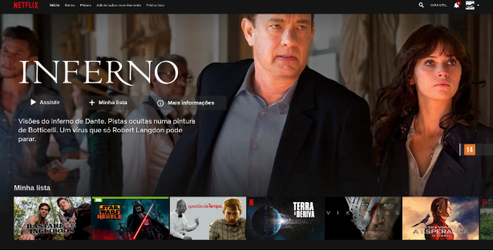
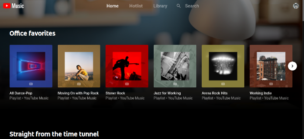

# Bem  vindo ao território de Frontend do Mestre dos Códigos

## Escudeiro

Torne-se um escudeiro superando todos os desafios a seguir ;)

### Prática

Desenvolver uma landing page, baseada na página principal do Youtube  Music e Netflix.

A página pode ser do tema que o candidato preferir, devendo apenas seguir e a mesma estrutura visual e contendo os itens apresentados nos requisitos a seguir.

Requisitos:

- Header com logo da aplicação, itens do menu e item de menu do usuário (avatar). O Header deve ter fundo transparente quando o scroll da página estiver no topo e alterar para um fundo opaco quando for realizado o 	scroll
- Um item principal em destaque
- Listagem dos itens organizados em Carrossel
- Footer contendo informações do desenvolvedor
- Layout responsivo para as resoluções mais utilizadas (Ex: 1366x768, 360x640, 768x1024)





Será avaliado:

-   Boas práticas de organização e estruturação do CSS SEM frameworks
-   Boas práticas de organização, estruturação e semântica do HTML5
-   Boas práticas do uso do Javascript e a manipulação do D.O.M.  SEM frameworks
-   Utilização do CSS Grid na estruturação da página
-   Responsividade da página
-   Apenas será avaliado a primeira página da aplicação (home)

O intuito desta etapa é tornar o desafiante familiarizado com a base de HTML, CSS e Javascript, criando uma estrutura sólida para os próximos níveis, por este motivo nesta etapa deve-se utilizar essas tecnologias sem abstrações ou ferramentas de terceiros. Sendo assim não será permitido o uso de frameworks, automatizadores ou pré-processadores, como: Vue, Bootstrap, SASS, PUG, Typescript, Webpack, React, JQuery, dentre outros...

Poderá ser utilizado javascript ES6, já que os navegadores mais utilizados possuem compatibilidade a algum tempo.

Recursos externos puramente estéticos podem ser utilizados, como imagens(svg, png, gif, etc..), fontes, e ícones(font-awesome, icomoon).


Caso haja alguma dúvida poderá ser aberto uma issue no github.


### Perguntas de Javascript

1. Explique com suas palavras a diferença entre a utilização de var, const e let?

---

2. Assinale a(s) diferença(s) entre Funções normais e Arrow Functions?

 - [ ] Funções normais não guardam escopo  
 - [ ] Funções normais guardam escopo  
 - [ ] Arrow function são mais rápidas  
 - [ ] Arrow function podem ser instanciadas  
 - [ ] Arrow function não guardam escopo  

---

3. qual o valor da constante name após a execução da função?

```javascript
 content = {
  name: "John",
  getName: function() {
    this.name = "James"
    return this.name
  }
}

userData = {
  name: "Luke",
  getName: content.getName
}
this.name = "Walter"
const name = userData.getName()

```
 - [ ] John
 - [ ] Luke
 - [ ] James
 - [ ] Walter

---

4. Qual o retorno da função event.getTitle()

```javascript
function Event(name, day) {
  this.date = day
  this.name = name

  this.getName = function() {
    return this.name
  }
  this.getDate = function() {
    return this.date
  }
}

const event = new Event("04/02/2019", "Event Test")

Event.prototype.getTitle = function() {
  return `The event ${this.name} will take place on ${this.date} `
}
event.getTitle()

```

 - [ ] The event 04/02/2019 will take place on Event Test
 - [ ] The event undefined will take place on undefined
 - [ ] Uncaught TypeError
 - [ ] The event null will take place on null

---

5. Quais são as formas de selecionar um elemento na DOM e qual a diferença entre elas?

---

6. Como inserir um evento em determinado elemento?

---

7. Como remover um evento em determinado elemento?

---

8. Descreva com suas palavras o que é event bubbling?

---

9. Descreva qual a diferença nos métodos de declaração de objetos?

```javascript
const object = {}
const object = new Object()
const object = Object.create()
```

---

10. Qual a diferença no uso de XMLHttpRequest e Fetch ? E qual devemos usar atualmente ?

---

11. O que são Promises ? Como podemos declarar uma promise em javascript ?

---

12. Liste 3 formas de iterar um Array em javascript e explique a diferença entre cada um deles?

---

13. Quando utilizar map, reduce ou filter ?

---

14. Qual o método do Array é mais indicado para remover elementos ?

---

15. Cite 4 métodos presentes na API de strings do Javascript e explique cada um deles;

---

16. Escreva um código para inserir e resgatar items do LocalStorage/SessionStorage

---

17. Qual a melhor forma para definir um cookie utilizando javascript ?

---

18. Quais os tipos de Loops existentes em javascript ?

---

19. Descreva com suas palavras o que é hoisting ?

---

20. Em um ambiente do browser. Qual o valor do this utilizando "use-strict";

 - [ ] window
 - [ ] global
 - [ ] undefined
 - [ ] null

---

21. Quando eu posso utilizar o "Use-strict" no meu código ?

 - [ ] No ínicio do meu código
 - [ ] No inicio do block if
 - [ ] No inicio de um loop
 - [ ] no inicio de uma função

## Cavaleiro

Torne-se um cavaleiro superando o desafio a seguir ;)

### Jogo da memória dos Vingadores

Deverá ser desenvolvido um jogo da memória utilizando a API da Marvel.
Link da api: [https://developer.marvel.com/](https://developer.marvel.com/)

####	Requisitos

- [ ] O jogo deve possuir ao menos 10 personagens.
- [ ] O jogo deve possuir o tema da Marvel como layout principal, ou seja, cores fontes e imagens devem ter o tema Marvel.
- [ ] O jogo deve possuir toda a lógica de `match` padrão de um jogo da memória.
- [ ] O jogo deve abrir uma tela/modal/sidebar quando houver o match, trazendo as informações do personagens em questão.
- [ ] O jogo deve trazer personagens aleatórios a cada refresh na página.
- [ ] O jogo deve possuir um score.
- [ ] O jogo deve possuir um cronômetro quando a primeira carta for virada.
- [ ] O jogo deve possuir um ranking salvo no `localStorage` do navegador.
- [ ] O jogo deve possuir testes unitários para o JavaScript.
- [ ] O jogo deve tratar possíveis exceções da API, como offline, erros no backend ou exceções genéricas.
- [ ] O jogo deve ser responsivo para as resoluções mais utilizadas (Ex: 1366x768, 360x640, 768x1024)

#### Faz parte do seu desafeio
- [ ]  Layout bem desenvolvido e agradável.
- [ ] Chamada a API com a autenticação necessária descrita na documentação da API.
- [ ] Pode utilizar frameworks/libs que estão na listagem de itens permitidos.
- [ ] Entendimento da documentação da API da Marvel.
- [ ] Organização e boas práticas no seu código.
- [ ] Utilizar Orientação a Objetos.

#### Requisitos técnicos

- HTML Semântico
- Browser suporte e vendor prefix
	 - Chrome
	 - Firefox
- Frameworks permitidos
	- VueJs
	- ReactJs
	- Angular
- PWA
	- Instalar o app na home screen do user
	- Remover a barra de pesquisa do usuário quando o site for instalado
	- Personalizar os ítens possíveis da splash screen
- CSS
	- Responsividade
		- [SUGESTÃO] Utilizar queries mobile first baseado no [bootstrap](https://getbootstrap.com/docs/4.3/layout/overview/)
	- Técnicas de organização do estilo
		- B.E.M
		- SMACSS
		- OOCSS
- Ferramentas auxiliares permitidas
	- Qualquer framework css
	- Typescript
	- Lodash
	- moment
	- axios
	- SASS/SCSS/STYLUS/LESS
	- Ferramentas de build e automatização como: webpack

## Mestre - Em breve!
