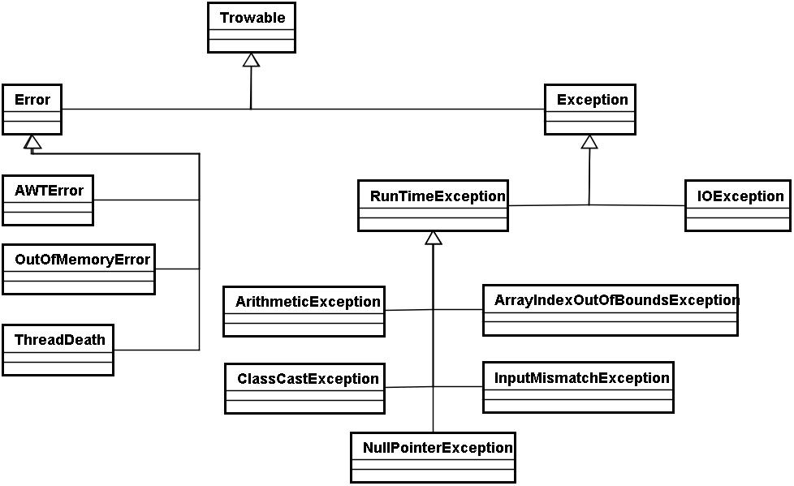

# Bem-vindo ao território de Java do Mestre dos Códigos

## Instruções

- Todas as respostas devem estar em algum repositório GIT na nuvem como projeto público.
- Você pode criar um único projeto ou vários projetos no repositório GIT, mas é importante que haja em algum lugar um arquivo informando a resolução de cada desafio, de forma que o avaliador encontre-o facilmente.
- É importante que existam instruções de execução dos desafios.

## Escudeiro

### O básico do Java

1. Vamos fazer uma viagem ao passado. O Java foi criado na década de 90. Vamos entender qual foi a motivação da criação da linguagem, seus principais conceitos e características e qual sua importância para o desenvolvimento de software. Faça, então, sua pesquisa e pontue seu entendimento sobre tudo isso.

2. No mundo Java existe uma sopa de letrinhas e siglas, mas algumas são fundamentais para o entendimento do propósito da linguagem. Vamos, então, aprender um pouco mais sobre a plataforma. Pesquise sobre:

    - JVM
    - JDK
    - JRE

  Pontue o que cada palavra significa, onde e quando usamos e qual a importância de cada uma deles:

3. Para começarmos desenvolver em Java, precisamos de muito pouco. Basta um editor de texto, uma outra coisinha que você aprendeu na questão de número 2 e um terminal. Crie uma classe Java utilizando um editor qualquer. Esta classe deve ter um método main que imprima a frase “Hello World!”, para começarmos com o pé direito esta aventura de programação. Agora faça uma explanação sobre:

    - O que você precisou para resolver esta questão;
    - O comando que você usou para compilar;
    - O comando que você usou para executar;
    - Qual é a estrutura miníma de uma classe Java;
    - O que é o método main e qual a sua importância;
    - O que é e em que momento da resolução da questão foi gerado o BYTECODE;

4. Durante muito tempo, uma das maiores dificuldades na hora de programar era o gerenciamento de memória. Os desenvolvedores eram responsáveis pela sua alocação e liberação manualmente, o que levava a muitos erros e memory leaks. Hoje, em todas as plataformas modernas (incluindo Java), temos gerenciamento de memória automático através de algoritmos de coleta de lixo. Pesquise sobre Garbage Collector e faça uma explanação de como este algoritmo funciona na plataforma Java. Também implemente dois algoritmos em Java: um que exemplifique um possível erro de OutOfMemoryError e outro que mostre os cuidados tomados para não acontecer este tipo de erro durante o desenvolvimento de software.

### Conhecendo a plataforma

#### Trabalhando com tipos de dados

1. O Java possui vários tipos de dados primitivos para resolvermos diversos problemas e, para cada tipo primitivo, existe uma classe WRAPPER. Pontue:

    - Diferença entre os tipos primitivos e as classes Wrapper;
    - Quais são os tipos primitivos e suas classes Wrapper;
    - Qual o valor default de cada tipo primitivo e de cada classe Wrapper;
    - Como consigo converter cada tipo primitivo em uma classe Wrapper e como consigo converter cada classe Wrapper em um tipo primitivo;
    - Um exemplo de utilização de cada tipo durante o desenvolvimento de software.

2. Qualquer programa de computador precisa manter informações de alguma forma. Assim, as linguagens de programação permitem a criação de variáveis. Pontue:

    - Declaração de variáveis com inicialização implícita;
    - Declaração de variáveis com inicialização explícita;
    - Obrigatoriedade de inicialização de variáveis no Java;
    - Como funciona o escopo de variáveis no Java;
    - Quando utilizar a palavra reservada final na declaração de uma variável.

3. Um dos tipos mais utilizados na plataforma Java é o tipo String, com S maiúsculo. Strings em Java são objetos ou instâncias da classe java.lang.String que devem ser declaradas e instanciadas. Vamos, então, concentrar nossa energia no estudo deste tipo tão importante. Crie exemplos utilizando String mostrando:

    - Como criamos um objeto do tipo String;
    - Como podemos concatenar uma String;
    - Quais os principais comportamentos de uma String;
    - Como trabalhamos com String utilizando as classes StringBuilder e StringBuffer, pontuando a diferença entre elas e qual a importância de usá-las;
    - Como transformamos String em outro tipo de dado;
    - Como podemos transformar qualquer tipo de dado em uma String.

4. Trabalhar com sistemas que manipulam valores decimais é uma tarefa crítica e que deve exigir o máximo de atenção do desenvolvedor. Trabalhar com Double pode trazer uma certa dificuldade quando precisamos de precisão em operações matemáticas de valores decimais. Uma alternativa para resolver esse problema é utilizar a classe BigDecimal, que trabalha com pontos flutuantes de precisão arbitrária, conseguindo estipular o nível de precisão do valor. Diante disso, vamos aprender a trabalhar com esta classe. Faça exemplos de algoritmo que:

    - Converta uma String para BigDecimal;
    - Converta um Double para BigDecimal;
    - Execute as operações matemáticas de subtração, adição, divisão, multiplicação e potência de números decimais, demostrando diferentes estratégias de arredondamento em todas as operações;
    - Faça a comparação entre 2 objetos to tipo BigDecimal.

5. No Java 8 foi introduzida uma nova API para manipulação de datas e horas. Vamos entender quais classes e métodos foram incluídos. Faça uma pesquisa sobre as classes listadas abaixo e mostre, por meio de algorítimos, onde cada uma pode ser usada e como podemos criar objetos de datas, manipular datas, extrair partes de datas, realizar comparações entre datas, alterar datas e converter entre os diversos tipos de datas listadas:

    - LocalDate;
    - LocalTime;
    - LocalDateTime;
    - MonthDay;
    - YearMonth;
    - Period.

6. É comum a necessidade de armazenamento de variáveis em memória sequencial. O Java permite esta implementação com o uso de arrays. Mostre, por meio de algoritmos, utilizando no mínimo dois tipos primitivos e dois tipos não primitivos (classes wrappers), como podemos:

    - Declarar um array;
    - Inicializar;
    - Acessar posições;
    - Percorrer um array.

#### Trabalhando com laços de repetição

7. Quando estamos desenvolvendo um software, por vários momentos surge a necessidade de executar uma parte do código várias vezes, como uma repetição. O Java oferece alguns tipos de laços de repetição para o programador escolher, então pesquise sobre o assunto e:

    - Faça um algoritmo demonstrando o funcionamento dos laços de repetição while, for, enhanced for e do/while;
    - Faça uma comparação entre os tipos de laços;
    - Demostre por meio de um algoritmo o funcionamento do break e do continue em laços de repetição.

#### Trabalhando com estrutura de dados

8. Trabalhar com estrutura de dados utilizando arrays pode ser uma tarefa difícil, pois arrays não permitem o redimensionamento. É impossível buscar um determinado elemento cujo índice é desconhecido, não conseguimos saber quantas posições do array foram populadas sem criarmos métodos adicionais para isso, entre outros problemas. Assim, para facilitar a vida do programador, foi criado um conjunto de interfaces e classes conhecidas como Collections Framework, que se encontra no pacote java.util. Veja o diagrama de classes abaixo e:

    - Demonstre, por meio de algoritmos, a utilização de cada uma delas, ressaltando qual o tipo de problema cada uma resolve e qual a importância de fazer a escolha certa.

9. O Java fornece uma segunda forma de trabalhar com estrutura de dados tão importante quanto a primeira. São as classes e interfaces relacionadas a trabalhar com mapas. Veja o diagrama de classes e:

    - Demonstre, por meio de algoritmos, a utilização de cada uma delas, ressaltando qual tipo de problema cada uma resolve e qual a importância de fazer a escolha certa.

#### Trabalhando com POO (Programação Orientada a Objetos)

10. Um dos pilares da POO é o encapsulamento. Fazemos isso por meio da criação de classes, atributos e métodos, definindo uma restrição de acesso utilizando os modificadores de acesso. Então, demonstre por meio de algoritmos:
 
    - Criação de métodos com argumentos e valores de retorno;
    - Criação de métodos sem argumentos e valores de retorno;
    - A aplicação da palavra-chave static em métodos e atributos, ressaltando a principal característica de um método static e um atributo static;
    - A sobrecarga de métodos;
    - A criação de construtores padrão, construtores com argumentos e a sobrecarga de construtores;
    - A aplicação de encapsulamento utilizando os modificadores de acesso.

11. Outros pilares da POO são a herança e o polimorfismo. Por isso, pesquise e demonstre, por meio de algoritmos:

    - Reaproveitamento de comportamentos de um objeto por meio da herança;
    - A utilização de classes abstratas, métodos abstratos e interfaces;
    - A utilização de métodos default em interfaces;
    - A utilização das palavras reservadas this e super;
    - Desenvolva um código que mostre o uso do polimorfismo com herança de classes e a implementação de interfaces.

#### Trabalhando com exceções

12. Todos algoritmo está sujeito a erros. O Java fornece uma API para trabalhar com exceções, nos permitindo fazer o tratamento adequado de uma determinada situação e até mesmo criarmos nossas próprias exceções. Assim, faça:

    - Veja o digrama de classe abaixo, diferencie quais são as exceções Checked, Runtime e Erros e descreva a diferença de cada tipo:
    
    - Faça um algoritmo demonstrando o uso do bloco try-catch-finally;
    - Faça uma pesquisa e demonstre quando ocorrem as exceções: ArithmeticException, ArrayIndexOutOfBoundsException, ClassNotFoundException, IOException, IllegalArgumentException, InterruptedException e NullPointerException;
    - Faça um algoritmo implementando uma exceção customizada.

#### Trabalhando com qualidade de código

13. A qualidade de um software não pode ser avaliada em um produto já feito. É fundamental que, durante o desenvolvimento, sejam adotadas técnicas para aprimorar a produção. Pesquise sobre testes unitários em Java e:

    - Pontue quais frameworks existem atualmente para auxiliar o desenvolvimento de testes unitários no ecossistema Java e a diferença entre eles;
    - Escolha um framework e faça testes unitários para pelo menos três exercícios desenvolvidos anteriormente;
    - Justifique sua escolha de framework e exercícios.

### Vamos praticar

1. Escolha dois problemas no site [Judge](https://www.urionlinejudge.com.br/judge/pt/categories) e:

    - Crie um algoritmo para resolver o problema utilizando o conhecimento adquirido nos exercícios anteriores;
    - Seu algoritmo deve ter uma cobertura de testes de no mínimo 80%;
    - Justifique a escolha dos problemas;
    - Envie seu código para o repositório GIT.

## Cavaleiro - Em breve!

## Mestre - Em breve!
